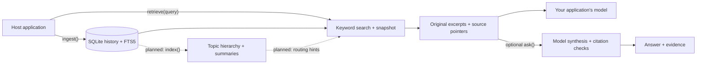

<div align="center">

<h1>chat-context-index</h1>

<p><strong>Preserve the conversation. Recover the context.</strong></p>
<p>A proposed embedded library for durable, retrievable conversation memory.</p>

<p>
  
  <a href="LICENSE"></a>
</p>

<p>
  <a href="#overview">Overview</a> ·
  <a href="#usage-preview">Usage preview</a> ·
  <a href="#how-it-works">How it works</a> ·
  <a href="#license">License</a>
</p>

</div>

> [!NOTE]
> **Early-stage project.** Python internals are under development; the public `ContextIndex` interface shown below is not implemented yet. The usage example remains illustrative, and planned features are labeled below.

## Overview

**chat-context-index (`cci`) is designed to help an AI application remember what was said and recover the original context when it matters.** It brings persistent conversation storage and relevant context retrieval into the application's own process.

Imagine a user returning after several sessions to ask, “Why did we make that decision?” The intended workflow is to reopen the same history, retrieve the earlier messages and their rationale, and give that evidence to the application's model. An optional `ask()` operation adds a cited answer.

The primary audience is developers building long-running assistants, agents, and conversational workflows. A Python CLI is also planned for inspecting exported histories.

| Capability | Intended behavior |
| :--- | :--- |
| **Preserve** | Keep accepted messages, their identities, and their order across application restarts. |
| **Recall** | Find relevant original excerpts when a user returns to an earlier discussion. |
| **Verify** | Resolve citations to stored messages; report partial results and insufficient evidence explicitly. |
| **Reuse** | Cache validated, identical model requests with `none`, `sqlite`, or `redis` modes. |
| **Embed** | Integrate through native Python and Node.js/TypeScript libraries. |

## Usage preview

The proposed lifecycle is **open → ingest → optionally index → retrieve → optionally ask → close**. Indexing is an explicit application choice; lexical search remains usable before a topic tree is built.

**Proposed Python interface — illustrative only, not runnable yet.** This example belongs inside application async code; `cfg` represents the application's storage, cache, model-provider, and resource settings.

```python
from cci import ContextIndex

async with ContextIndex.open("memory.sqlite", config=cfg) as memory:
    await memory.ingest(
        [{
            "external_id": "preference-001",
            "role": "user",
            "content": "Use UTC for all scheduled reports.",
        }],
        source_id="assistant-app",
        idempotency_key="session-001-batch-001",
        session_id="session-001",
    )

    await memory.index()  # Optional; the application controls when this runs.
    context = await memory.retrieve("Which timezone should scheduled reports use?")
    # Pass context.evidence to your application's model as historical data.

    # Optional convenience: retrieve evidence and synthesize a cited answer.
    result = await memory.ask("Which timezone should scheduled reports use?")
```

Other planned operations include search, message access, export/import, history clearing, and diagnostics. When integrating retrieved messages into a prompt, keep them in a clearly separated evidence section so their contents are treated as historical data.

## How it works

The library keeps conversation history in a local SQLite database. The current Python internals provide storage, ingestion, lexical retrieval, and an `ask()` pipeline through a supplied model provider. Topic-tree indexing and cache adapters are planned.



1. **Save the original conversation.** `ingest()` validates a batch, assigns message IDs and increasing sequence numbers, and stores the original payload separately from its searchable text projection. Messages, FTS5 entries, and the ingestion receipt commit in one SQLite transaction. Retrying the same `source_id`, `idempotency_key`, and input replays the receipt. Deduplication uses source identity; two distinct messages can contain identical text.

2. **Organize topics when requested — planned.** An explicit `index()` call will group pending conversation into chunks beneath a time-ordered topic hierarchy. Model-generated titles and summaries will help route queries to original messages. They are navigation aids, never citable evidence. Indexing will update the affected portion of the tree; a provider failure will leave stored messages and lexical search available. Ingestion does not trigger indexing.

3. **Retrieve evidence for a query.** `retrieve()` captures the history revisions and message boundary in a short read transaction, then searches FTS5 within that snapshot. The current implementation uses literal query terms, returns matches in conversation order, and makes no model calls. It returns up to eight matches by default, each with an excerpt, message ID, sequence number, source pointer, and content hash. With no topic tree, `auto` and `tree` requests use this lexical path and report `index_degraded`. A query with no matches returns `status="empty"`; different wording can miss relevant messages. Planned tree routing will supplement this path without requiring embeddings or a vector database.

4. **Optionally generate an answer.** Your application can use the retrieved evidence directly, or call `ask()` to retrieve evidence and send it to a configured provider. With no evidence, `ask()` returns `insufficient_evidence` without calling the model. Otherwise, it requests one synthesis pass and checks that cited evidence IDs belong to this response. Unknown citation IDs allow at most one repair pass; if they remain invalid, the answer is suppressed and the result is `partial`. These checks establish source references, not factual correctness. Historical text is rendered in separate evidence blocks, and recorded tool calls are not executed.

5. **Reuse eligible model work — planned.** Optional `none`, `sqlite`, and `redis` cache modes will sit behind the provider layer, separate from authoritative history storage. Reuse will require an exact match of the effective request and history scope, compatible versions, a validated payload, and an unexpired entry (24-hour lifetime by default). Classification, summaries, and routing results are eligible; final answers and failed requests are excluded. Cache loss will affect reuse without deleting conversation history. The current provider wrapper handles concurrency, timeouts, and retries, but does not yet cache responses.

The host application owns authentication, user-to-history access, provider configuration, and scheduling. The deployment target is one owning application process per history on durable local storage. Opening a history starts an owned SQLite I/O worker; closing it releases the connection and worker. Using a remote model sends the query and selected evidence to that provider.

Implementation entry points: [storage](packages/python/src/cci/store.py), [ingestion](packages/python/src/cci/ingest.py), [retrieval](packages/python/src/cci/retrieve.py), and [answer synthesis](packages/python/src/cci/ask.py). The [storage contract](spec/storage-format.md) and [cache contract](spec/cache-format.md) describe the persistence and planned reuse rules in detail.

## Acknowledgments

Inspired by [VectifyAI/ChatIndex](https://github.com/VectifyAI/ChatIndex) and its approach to organizing and retrieving conversation context through a topic hierarchy.

## License

[Apache License 2.0](LICENSE).
