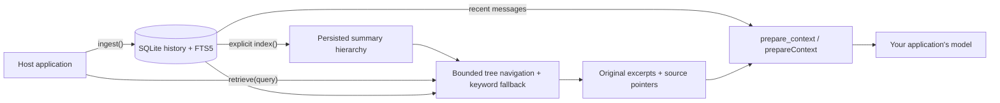

<div align="center">

<h1>chat-context-index</h1>

<p><strong>Preserve the conversation. Recover the context.</strong></p>
<p>Persistent conversation memory for RAG chats and agents, with bounded tree retrieval.</p>

<p>
  
  <a href="LICENSE"></a>
</p>

<p>
  <a href="#overview">Overview</a> ·
  <a href="#quick-start">Quick start</a> ·
  <a href="#measured-example">Measured example</a> ·
  <a href="#how-it-works">How it works</a> ·
  <a href="#license">License</a>
</p>

</div>

> [!NOTE]
> **Pre-release.** Fresh Python wheels and npm archives pass installed memory checks, including process restarts and reading the same tree across both runtimes. The full local test suite passes. Live-model recall, dollar savings, and registry publication remain pending.

## Overview

**ContIndex (`chat-context-index`, imported as `cci` in Python) gives an existing RAG chat or agent loop persistent conversation memory.** It saves original messages in SQLite, indexes them in a summary hierarchy, and prepares recent context plus relevant older evidence for the host's model.

The host keeps its document retriever, model, and agent framework. ContIndex supplies conversation context through `prepare_context()` in Python and `prepareContext()` in TypeScript. Reopening the same durable history restores its records and tree. Agent execution checkpoints remain the host's responsibility.

| Responsibility | Current approach |
| :--- | :--- |
| **Preserve** | Original payloads, source identities, ordering, and replayable ingestion receipts in SQLite. |
| **Index** | Explicit incremental chunk summaries and bounded parent/child hierarchy; unchanged branches reuse summaries. |
| **Retrieve** | Bounded model-guided tree navigation with FTS5 fallback. Only original messages become evidence. |
| **Prepare context** | Public APIs combine recent messages with retrieved sources under record, character, and optional tokenizer-specific limits. |
| **Answer** | Optional `ask()` synthesizes from retrieved evidence and checks citation references through a supplied provider. |
| **Inspect** | Python APIs and CLI for reading, exporting, importing, clearing, and inspecting histories. |

## Quick start

From the repository root, using Python 3.11–3.14:

```bash
python3 -m venv .venv
.venv/bin/python -m pip install -e ./packages/python
.venv/bin/python examples/python/brand_memory.py
.venv/bin/python evaluations/brand_memory.py --out evaluations/results/brand-memory.json
.venv/bin/python evaluations/tree_memory.py --out evaluations/results/tree-memory.json
```

The [brand example](examples/python/brand_memory.py) writes two synthetic histories in one process and reads them in another. It uses temporary databases and makes no model calls. Its output includes the recent $799 correction for one brand and the independent $199 offer for the other. It prints historical context for a model to consume.

The Python library currently exposes `HistoryStore` and operations from their own modules:

```python
import asyncio

from cci import HistoryStore
from cci.config import Config
from cci.ingest import ingest
from cci.models import InputMessage
from cci.retrieve import retrieve


async def main():
    async with await HistoryStore.open(
        "memory.sqlite", config=Config(cache_backend="none")
    ) as memory:
        await ingest(
            memory,
            memory.history_id,
            [InputMessage(
                external_id="preference-001",
                role="user",
                content="Use UTC for all scheduled reports.",
            )],
            source_id="assistant-app",
            idempotency_key="turn-001",
        )
        result = await retrieve(memory, "UTC", mode="lexical")
        for evidence in result.evidence:
            print(evidence.message_id, evidence.excerpt)


asyncio.run(main())
```

Use an application-owned path on durable storage to reopen a history later. The [Python](examples/python/rag_chat.py) and [TypeScript](examples/typescript/rag-chat.mjs) adapters connect memory to a host's chat loop. A provider-free call stays lexical; pass an explicit provider and build the index to enable tree navigation.

### Choose a model provider

Both runtimes accept an application-supplied `Provider`; the memory store does not choose a vendor or model.
The smoke and held-out evaluators now share configurable model selection. For example, in the ignored
`.env.live-smoke` file:

```dotenv
CCI_PROVIDER=gemini
CCI_MODEL=your-model-id
CCI_API_KEY=your-provider-key
```

Presets cover OpenAI, Gemini, Anthropic, Groq, OpenRouter, and local Ollama through their Chat Completions
compatibility endpoints. Set `CCI_BASE_URL` for another compatible service. Other native APIs can implement
the package's `Provider` contract. See [configuration and limits](evaluations/LIVE_SMOKE.md); these presets
have offline routing tests, and a successful real-model evaluation is still pending.

## Measured example

The [tree dry run](evaluations/results/tree-memory.json) uses 128 synthetic messages and a deterministic provider double. Full-history evidence contains **207,260 characters**; selected memory contains **4,868**. Navigation adds **19,492 input characters across four calls**. Initial indexing takes **171 calls**; an unchanged rerun takes zero. These are reproducible mechanics and character counts, **not token savings, dollar savings, or semantic recall scores**. [Evaluation script](evaluations/tree_memory.py).

The [development evaluation](evaluations/brand_memory.py) uses 23 synthetic messages across two histories. All strategies share an eight-message limit, 200-character excerpts, and a 4,000-character limit on rendered evidence, including labels.

| Approach | Required source evidence found, across eight answerable cases |
| :--- | :---: |
| Recent history only | 6 / 8 |
| Current lexical retrieval | 4 / 8 |
| Recent history plus lexical retrieval | 7 / 8 |

The combined approach recovered older facts and a recent correction, but missed a timezone preference that recent history alone retained. These are small, hand-authored development cases. They establish neither general retrieval accuracy nor answer correctness. Two additional cases check behavior without supporting evidence. No model was called.

The [complete report](evaluations/results/brand-memory.json) includes per-case results, source fingerprints, environment versions, and storage checks. Five example boundary tests and seven existing persistence/ingestion tests passed locally.

## How it works

The library keeps history in SQLite, while the host controls what reaches its model:



1. **Save the original conversation.** `ingest()` validates a batch, assigns message IDs and increasing sequence numbers, and stores the original payload separately from its searchable text projection. Messages, FTS5 entries, and the ingestion receipt commit in one SQLite transaction. Retrying the same `source_id`, `idempotency_key`, and input replays the receipt. Deduplication uses source identity; two distinct messages can contain identical text.

2. **Build the hierarchy explicitly.** `index()` summarizes pending chunks and groups consecutive nodes with bounded fanout. It reuses unchanged branch summaries and publishes a complete topology atomically. Large backlogs may need multiple bounded calls. No-change indexing makes zero model calls.

3. **Retrieve within a snapshot.** With a supplied provider, `tree` and `auto` navigate branch summaries, validate selected IDs, and load original source fields. Navigation steps and attempts, including retries, are capped. Lexical search remains available without a model and as a fallback. Index changes discard affected tree selections; a history clear invalidates the request.

4. **Prepare the next turn.** The context API reserves recent messages, adds retrieved source evidence, deduplicates source fields, and restores conversation order. Labels and escaped delimiters count toward the budget. The host supplies this historical data alongside its document RAG results, trusted instructions, and new question. Optional `ask()` performs retrieval and cited synthesis, but does not include the context API's recent-message reserve.

The hierarchy follows [VectifyAI/ChatIndex](https://github.com/VectifyAI/ChatIndex)'s summary-to-source approach, using an independently implemented chronological grouping algorithm. It does not reproduce upstream's topic-boundary detection. Python's optional memoization remains separate from authoritative history.

## Current boundaries

- The supported topology is one owning application process per history on durable local storage. A serverless or distributed deployment needs a separate storage design.
- Literal keyword retrieval can miss paraphrases; tree recall depends on the routing model and summaries. Live quality and automatic conflict resolution are not established.
- Context is historical text. The host retains execution checkpoints, pending tool work, and rules for replaying side effects. Memory alone cannot restart an interrupted executor.
- Total cost includes index building, updates, navigation, and answering. Shorter final context alone does not prove savings.
- The host owns authentication, authorization, user/brand-to-history mapping, and scheduling. Database separation in the example does not implement those policies.
- Local verification passes: 106 Python tests, 8 native TypeScript tests, and fresh installed-package memory checks. Linux CI execution and real-model release evaluation remain open.

Implementation entry points: [storage](packages/python/src/cci/store.py), [ingestion](packages/python/src/cci/ingest.py), [retrieval](packages/python/src/cci/retrieve.py), and [answer synthesis](packages/python/src/cci/ask.py).


## License

[Apache License 2.0](LICENSE).
