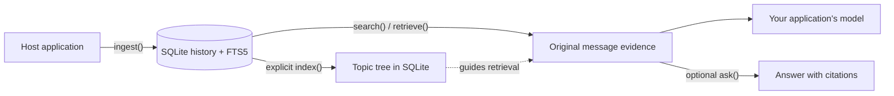

<div align="center">

<h1>chat-context-index</h1>

<p><strong>Preserve the conversation. Recover the context.</strong></p>
<p>A proposed embedded library for durable, retrievable conversation memory.</p>

<p>
  <a href="#roadmap"></a>
  <a href="#documentation"></a>
  <a href="LICENSE"></a>
</p>

<p>
  <a href="#overview">Overview</a> ·
  <a href="#workflow">Workflow</a> ·
  <a href="#architecture">Architecture</a> ·
  <a href="#roadmap">Roadmap</a> ·
  <a href="#documentation">Documentation</a>
</p>

</div>

> [!NOTE]
> **Specification stage · 22 September 2026.** PRD v0.4 is proposed; implementation has not started. There are no library packages, runnable examples, tests, or benchmark results yet. Everything below describes the intended design.

## Overview

**chat-context-index (`cci`) is designed to help an AI application remember what was said and recover the original context when it matters.** It combines a durable SQLite history, lexical search, and an incremental topic tree inside the application's own process.

Imagine a user returning after several sessions to ask, “Why did we make that decision?” The intended workflow is to reopen the same history, retrieve the earlier messages and their rationale, and give that evidence to the application's model. An optional `ask()` operation adds a cited answer.

The primary audience is developers building long-running assistants, agents, and conversational workflows. A Python CLI is also planned for inspecting exported histories.

| Capability | Intended behavior |
| :--- | :--- |
| **Preserve** | Keep accepted messages, their identities, and their order across application restarts. |
| **Recall** | Find relevant original excerpts with lexical search and topic-tree guidance. |
| **Verify** | Resolve citations to stored messages; report partial results and insufficient evidence explicitly. |
| **Reuse** | Cache validated, identical model requests with `none`, `sqlite`, or `redis` modes. |
| **Embed** | Offer native Python and Node.js/TypeScript libraries governed by one shared contract. |

## Workflow

The proposed lifecycle is **open → ingest → optionally index → retrieve → optionally ask → close**. Indexing is an explicit application choice; lexical search remains usable before a topic tree is built.

**Proposed Python interface — illustrative only.** This follows the PRD's API design and cannot run yet. It belongs inside application async code; `cfg` represents validated storage, cache, provider, and resource settings.

```python
from cci import ContextIndex

async with ContextIndex.open("memory.sqlite", config=cfg) as memory:
    await memory.ingest(
        [{
            "external_id": "decision-001",
            "role": "user",
            "content": "Keep history in SQLite. Use Redis only for caching.",
        }],
        source_id="assistant-app",
        idempotency_key="session-001-batch-001",
        session_id="session-001",
    )

    await memory.index()  # Optional; the application controls when this runs.
    context = await memory.retrieve("Where should conversation history live?")
    # Pass context.evidence to your application's model as historical data.

    # Optional convenience: retrieve evidence and synthesize a cited answer.
    result = await memory.ask("Where should conversation history live?")
```

The full proposed API also includes lexical `search()`, message and tree reads, export/import, whole-history clearing, and diagnostics. Retrieved messages belong in a clearly separated evidence section of a prompt: their contents are historical data, including any instructions or tool calls recorded in them.

## Architecture



SQLite holds authoritative history and committed index state. Optional SQLite or Redis memoization stores reusable model results; cache loss must leave committed history intact. The application owns authentication, history selection, scheduling, and deployment.

| Design decision | Contract |
| :--- | :--- |
| **Durable history** | A successful ingestion receipt follows a committed SQLite transaction. Repeated text keeps its distinct message identity. |
| **Original evidence** | Lexical search and topic routing lead to raw messages. Summaries guide retrieval; every citation must resolve within the request's history and snapshot. |
| **Explicit model work** | `ingest()` never triggers indexing. `ask()` uses one bounded synthesis pass, with at most one bounded repair. |
| **Exact-request caching** | Reuse requires matching effective inputs and compatible versions; failed or incomplete responses cannot become successful cache entries. |
| **Native implementations** | Python is the reference implementation. TypeScript implements the same schemas, prompts, and fixtures natively. |

**Deployment target:** one owning application process per history, backed by durable local storage. The first release targets Python 3.11–3.14 and Node.js 22.x/24.x on Linux x64 and macOS arm64. Remote model providers or remote caches introduce network dependencies.

**First-release scope:** ingestion, retrieval, cited answers, caching, export/import, clearing, diagnostics, both libraries, and the Python CLI. A hosted API, web UI, vector database, Redis as authoritative history, and multi-round agent orchestration are outside this release.

## Roadmap

Milestones are ordered by dependency. **All remain unstarted**; the sequence below is a delivery plan, with no promised dates.

| Milestone | Deliverable | Completion gate |
| :--- | :--- | :--- |
| **M0 · Contract baseline** | Upstream reference, schemas, identity rules, cache format, and driver policy | Reviewed fixtures; settled identity and data-loss semantics |
| **M1 · Python core** | Durable storage, ingestion, lexical retrieval, export/import, and clearing | Core persistence and lifecycle checks pass from a built wheel |
| **M2 · Context retrieval** | Incremental topic tree, bounded retrieval, and cited synthesis | Retrieval and evidence checks pass; unindexed history stays usable |
| **M3 · Python preview** | Cache adapters, diagnostics, CLI, and failure handling | Preview installation and benchmark report available; cache checks pass |
| **M4 · TypeScript parity** | Native Node.js/TypeScript implementation | Shared compatibility checks pass across both packaged artifacts |
| **M5 · First release** | Published packages, documentation, and reproducible evaluations | Every release gate passes |

M0 still needs an exact upstream ChatIndex commit, pinned APSW / `better-sqlite3` versions, and registry availability checks. Proposed package names are `chat-context-index` (Python import and CLI: `cci`) and `@nexomnis/chat-context-index` (npm).

Python may ship first as a preview. Dual-language support can be claimed only after both published artifacts pass the shared compatibility suite.

## Documentation

Git currently tracks this README, [LICENSE](LICENSE), and [.gitignore](.gitignore). The detailed specification lives in the gitignored `vault-context/` and `.specify/` directories. **The links inside the sections below require those local files; they are unavailable in a fresh clone or on GitHub.**

<details>
<summary><strong>Local specification · reading guide</strong></summary>

| Start here | What it covers |
| :--- | :--- |
| [Home](vault-context/00-Home/Home.md) | Vault map and project orientation |
| [PRD v0.4](vault-context/01-Source-of-Truth/PRD.md) | Product baseline, invariants, API examples, and release gates |
| [Product overview](vault-context/01-Source-of-Truth/Product-Overview.md) · [Scope](vault-context/01-Source-of-Truth/Scope.md) | User journey, required outcomes, and release boundaries |
| [Current feature specification](.specify/specs/001-cci-first-release/spec.md) | Draft first-release behavior and recorded clarifications |
| [Constitution](.specify/memory/constitution.md) | Binding integrity, evidence, privacy, and conformance principles; v1.0.0 |
| [API reference](vault-context/02-Architecture/APIs.md) · [Prompt architecture](vault-context/AI/Prompt-Architecture.md) | Proposed operations, result contracts, and bounded model work |
| [Implementation plan](vault-context/05-Implementation/Implementation-Plan.md) | Milestones and their exit criteria |

The PRD is the baseline; the current feature specification carries recorded clarifications. The constitution, contracts, and accepted ADRs constrain both.

The feature specification settles two items still listed as open in the older [project status](vault-context/00-Home/Project-Status.md) note: Windows and other untested platforms are outside the first release, and SQLite versions below the required 3.51.3 minimum have no default backport allowance. Any older-runtime exception requires a separately reviewed compatibility decision.

</details>

<details>
<summary><strong>Local specification · architecture decisions</strong></summary>

| Record | Decision |
| :--- | :--- |
| [ADR-001](vault-context/04-Decisions/ADR-001-sqlite-authoritative-redis-optional-cache.md) | SQLite is authoritative; Redis is an optional disposable cache. |
| [ADR-002](vault-context/04-Decisions/ADR-002-lexical-tree-retrieval-no-vector-db.md) | Retrieval combines lexical search with an incremental topic tree. |
| [ADR-003](vault-context/04-Decisions/ADR-003-native-dual-language-no-subprocess-bridge.md) | Python and TypeScript are native implementations of one contract. |
| [ADR-004](vault-context/04-Decisions/ADR-004-exact-request-memoization-no-semantic-cache.md) | Memoization keys an exact request. |
| [ADR-005](vault-context/04-Decisions/ADR-005-one-pass-synthesis-no-multi-round-agents.md) | Synthesis is limited to one pass and at most one bounded repair. |
| [ADR-006](vault-context/04-Decisions/ADR-006-explicit-indexing-no-background-worker.md) | The host explicitly invokes indexing. |

See the [ADR index](vault-context/04-Decisions/ADR-Index.md) for decision status.

</details>

<details>
<summary><strong>Local workspace · repository layout</strong></summary>

```text
.
├── README.md
├── LICENSE
├── .gitignore
├── .claude/skills/          # Local Spec Kit command skills; gitignored
├── .specify/               # Local specifications and scaffold; gitignored
│   ├── memory/constitution.md
│   └── specs/001-cci-first-release/
└── vault-context/          # Local Obsidian specification vault; gitignored
    ├── 00-Home/
    ├── 01-Source-of-Truth/
    ├── 02-Architecture/
    ├── 04-Decisions/
    ├── 05-Implementation/
    ├── 09-Logs/
    └── AI/
```

The implementation plan proposes `spec/`, `packages/python/`, `packages/typescript/`, `tests/conformance/`, `examples/`, and `benchmarks/`. Those directories do not exist yet.

</details>

## Acknowledgments

The design builds on [VectifyAI/ChatIndex](https://github.com/VectifyAI/ChatIndex) and its temporally ordered topic hierarchy with retrieval at multiple levels of detail. `cci`'s proposed extensions are durable persistence, explicit lifecycle and failure behavior, cache adapters, evidence contracts, and native Python and TypeScript packaging.

## License

[Apache License 2.0](LICENSE).
