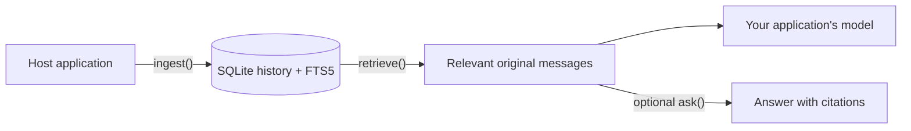

<div align="center">

<h1>chat-context-index</h1>

<p><strong>Preserve the conversation. Recover the context.</strong></p>
<p>A proposed embedded library for durable, retrievable conversation memory.</p>

<p>
  
  <a href="LICENSE"></a>
</p>

<p>
  <a href="#overview">Overview</a> ·
  <a href="#usage-preview">Usage preview</a> ·
  <a href="#how-it-works">How it works</a> ·
  <a href="#license">License</a>
</p>

</div>

> [!NOTE]
> **Early-stage project.** Implementation has not started, and no installable package is available yet. The capabilities and API below describe intended behavior and may change.

## Overview

**chat-context-index (`cci`) is designed to help an AI application remember what was said and recover the original context when it matters.** It brings persistent conversation storage and relevant context retrieval into the application's own process.

Imagine a user returning after several sessions to ask, “Why did we make that decision?” The intended workflow is to reopen the same history, retrieve the earlier messages and their rationale, and give that evidence to the application's model. An optional `ask()` operation adds a cited answer.

The primary audience is developers building long-running assistants, agents, and conversational workflows. A Python CLI is also planned for inspecting exported histories.

| Capability | Intended behavior |
| :--- | :--- |
| **Preserve** | Keep accepted messages, their identities, and their order across application restarts. |
| **Recall** | Find relevant original excerpts when a user returns to an earlier discussion. |
| **Verify** | Resolve citations to stored messages; report partial results and insufficient evidence explicitly. |
| **Reuse** | Cache validated, identical model requests with `none`, `sqlite`, or `redis` modes. |
| **Embed** | Integrate through native Python and Node.js/TypeScript libraries. |

## Usage preview

The proposed lifecycle is **open → ingest → optionally index → retrieve → optionally ask → close**. Indexing is an explicit application choice; lexical search remains usable before a topic tree is built.

**Proposed Python interface — illustrative only, not runnable yet.** This example belongs inside application async code; `cfg` represents the application's storage, cache, model-provider, and resource settings.

```python
from cci import ContextIndex

async with ContextIndex.open("memory.sqlite", config=cfg) as memory:
    await memory.ingest(
        [{
            "external_id": "preference-001",
            "role": "user",
            "content": "Use UTC for all scheduled reports.",
        }],
        source_id="assistant-app",
        idempotency_key="session-001-batch-001",
        session_id="session-001",
    )

    await memory.index()  # Optional; the application controls when this runs.
    context = await memory.retrieve("Which timezone should scheduled reports use?")
    # Pass context.evidence to your application's model as historical data.

    # Optional convenience: retrieve evidence and synthesize a cited answer.
    result = await memory.ask("Which timezone should scheduled reports use?")
```

Other planned operations include search, message access, export/import, history clearing, and diagnostics. When integrating retrieved messages into a prompt, keep them in a clearly separated evidence section so their contents are treated as historical data.

## How it works



The intended flow keeps conversation history in local SQLite storage and returns relevant original messages for a new question. Your application can pass those messages to its own model or request a cited answer through `ask()`.

Optional caching is designed to reuse eligible model work independently of history storage. The application controls which history to open and when to index it. The initial deployment target is one owning application process per history with durable local storage.


## License

[Apache License 2.0](LICENSE).
