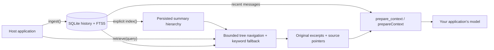

<div align="center">

<h1>chat-context-index</h1>

<p><strong>Preserve the conversation. Recover the context.</strong></p>
<p>Persistent conversation memory for RAG chats and agents, with bounded tree retrieval.</p>

<p>
  <a href="https://pypi.org/project/chat-context-index/"></a>
  
  <a href="LICENSE"></a>
</p>

<p>
  <a href="#overview">Overview</a> ·
  <a href="#install">Install</a> ·
  <a href="#quick-start">Quick start</a> ·
  <a href="#measured-example">Measured example</a> ·
  <a href="#how-it-works">How it works</a> ·
  <a href="#license">License</a>
</p>

</div>

> [!NOTE]
> **Python 0.1.0 is released** on [PyPI](https://pypi.org/project/chat-context-index/0.1.0/) ([GitHub release `v0.1.0`](https://github.com/Ajitkumar-1001/Chat-context-index/releases/tag/v0.1.0), commit `46ac4c2`). [Release run 36097901586](https://github.com/Ajitkumar-1001/Chat-context-index/actions/runs/36097901586) rebuilt, checked and published a wheel and source archive byte-identical to those [main CI run 36094205085](https://github.com/Ajitkumar-1001/Chat-context-index/actions/runs/36094205085) built and tested; their SHA-256 digests match PyPI's (wheel `411e7b8e…`, source `1d191e28…`). [Release verification record](evaluations/results/production-readiness-20260924/execution/release-0.1.0-verification.json). **TypeScript 0.1.0 is on [GitHub Packages](https://github.com/Ajitkumar-1001/Chat-context-index/pkgs/npm/chat-context-index)** as `@ajitkumar-1001/chat-context-index`, not on npmjs: its npmjs publish job failed. [Publish run 36185209650](https://github.com/Ajitkumar-1001/Chat-context-index/actions/runs/36185209650) checked the CI-tested archive (`2c13e400…`) against the release approval, changed only its package name, published it, then installed it from the registry and recalled a stored message. No live-model smoke, held-out answer-quality or cost trial, or human validation has been run on this build. The PyPI 0.1.0 page still shows the description written before upload, which calls the package a pre-release candidate; install it as shown below.

That CI run passed 556 Python and 106 Node tests, rebuilt the wheel from the source archive, and
passed all 16 install jobs (Python 3.11–3.14, Node 22/24, Linux x64 and macOS arm64).

## Overview

**ContIndex (`chat-context-index`, imported as `cci` in Python) gives an existing RAG chat or agent loop persistent conversation memory.** It saves original messages in SQLite, indexes them in a summary hierarchy, and prepares recent context plus retrieved older evidence for the host's model.

The host keeps its document retriever, model, and agent framework. ContIndex supplies conversation context through `prepare_context()` in Python and `prepareContext()` in TypeScript. Reopening the same durable history restores its records and tree. Agent execution checkpoints remain the host's responsibility.

| Responsibility | Current approach |
| :--- | :--- |
| **Preserve** | Original payloads, source identities, ordering, and replayable ingestion receipts in SQLite. |
| **Index** | Explicit incremental chunk summaries and bounded parent/child hierarchy; unchanged branches reuse summaries. |
| **Retrieve** | Bounded model-guided tree navigation with FTS5 fallback. Only original messages become evidence. |
| **Prepare context** | Public APIs combine recent messages with retrieved sources under record, character, and optional tokenizer-specific limits. |
| **Answer** | Optional `ask()` synthesizes from retrieved evidence and checks citation references through a supplied provider. |
| **Inspect** | Python APIs and CLI for reading, exporting, importing, clearing, and inspecting histories. |

## Install

Python 3.11–3.14:

```bash
python -m pip install chat-context-index
```

The package imports as `cci` and installs the `cci` command. Add `[redis]` for Redis memoization
or `[openai]` for the CLI's `--provider openai`. Importing the package makes no model calls.

TypeScript (Node.js 22 or later, ESM) is on GitHub Packages as `@ajitkumar-1001/chat-context-index`.
GitHub's npm registry requires a classic personal access token with `read:packages`, even for
public packages. Set `GITHUB_PACKAGES_TOKEN` to that token and add to your project's `.npmrc`:

```ini
@ajitkumar-1001:registry=https://npm.pkg.github.com
//npm.pkg.github.com/:_authToken=${GITHUB_PACKAGES_TOKEN}
```

Then install it under its npmjs name, so imports stay `from "chat-context-index"`:

```bash
npm install chat-context-index@npm:@ajitkumar-1001/chat-context-index@0.1.0
```

To build from source instead, run `npm ci && npm run build && npm pack` in `packages/typescript`,
then install the tarball as its [README](packages/typescript/README.md) shows.

## Quick start

Existing schema-version-1 histories require an explicit, backed-up migration before opening
with these SDKs. New histories use schema version 2. See [migration and recovery](docs/backup-and-migration.md).

The examples and evaluations below run from a clone of this repository. From the repository root,
using Python 3.11–3.14:

```bash
python3 -m venv .venv
.venv/bin/python -m pip install -e ./packages/python
.venv/bin/python examples/python/brand_memory.py
.venv/bin/python evaluations/brand_memory.py --out evaluations/results/brand-memory.json
.venv/bin/python evaluations/tree_memory.py --out evaluations/results/tree-memory.json
```

The [brand example](examples/python/brand_memory.py) writes two synthetic histories in one process and reads them in another. It uses temporary databases and makes no model calls. Its output includes the recent $799 correction for one brand and the independent $199 offer for the other. It prints historical context for a model to consume.

The Python library currently exposes `HistoryStore` and operations from their own modules:

```python
import asyncio

from cci import HistoryStore
from cci.config import Config
from cci.ingest import ingest
from cci.models import InputMessage
from cci.retrieve import retrieve


async def main():
    async with await HistoryStore.open(
        "memory.sqlite", config=Config(cache_backend="none")
    ) as memory:
        await ingest(
            memory,
            memory.history_id,
            [InputMessage(
                external_id="preference-001",
                role="user",
                content="Use UTC for all scheduled reports.",
            )],
            source_id="assistant-app",
            idempotency_key="turn-001",
        )
        result = await retrieve(memory, "UTC", mode="lexical")
        for evidence in result.evidence:
            print(evidence.message_id, evidence.excerpt)


asyncio.run(main())
```

Use an application-owned path on durable storage to reopen a history later. The [Python](examples/python/rag_chat.py) and [TypeScript](examples/typescript/rag-chat.mjs) adapters connect memory to a host's chat loop. A provider-free call stays lexical; pass an explicit provider and build the index to enable tree navigation.

### Choose a model provider

Both runtimes accept an application-supplied `Provider`; the memory store does not choose a vendor or model.
The smoke and held-out evaluators now share configurable model selection. For example, in the ignored
`.env.live-smoke` file:

```dotenv
CCI_PROVIDER=gemini
CCI_MODEL=your-model-id
CCI_API_KEY=your-provider-key
```

Presets cover OpenAI, Gemini, Anthropic, Groq, OpenRouter, and local Ollama through their Chat Completions
compatibility endpoints. Set `CCI_BASE_URL` for another compatible service. Other native APIs can implement
the package's `Provider` contract. See [configuration and limits](evaluations/LIVE_SMOKE.md). All presets
have offline routing tests; the installed Python wheel (`219fd1e7…`) from measured candidate
`e762f7bd` passed the [Gemini development smoke](evaluations/results/production-readiness-20260924/execution/live-smoke-candidate-004-summary.json).
Other providers have not passed a live run.

### Cache eligible model work

Python can memoize repeated indexing and tree-navigation requests. Local SQLite is the default;
Redis is optional and uses a local SQLite fallback. The authoritative conversation stays in the
history database. The host passes its provider adapter explicitly:

```python
from cci import HistoryStore
from cci.index import index
from cci.provider import MemoizedProvider
from cci.stats import stats

async def index_with_cache(my_adapter):
    async with await HistoryStore.open("memory.sqlite", config={"cache_backend": "sqlite"}) as memory:
        provider = MemoizedProvider(my_adapter, memory.config, cache=memory.cache,
                                    usage_log=memory.usage_log)
        await index(memory, provider=provider)
        counters = await stats(memory)
        return counters.memo_hits, counters.redis_errors, counters.sqlite_fallback_hits
```

See the [local-cache](docs/quickstart-no-redis.md) and [Redis](docs/quickstart-redis.md)
examples. Answer synthesis is never cached. The TypeScript runtime currently has no Redis
memoization backend.

## Measured example

The [installed-package live smoke on September 25, 2026 UTC](evaluations/results/production-readiness-20260924/execution/live-smoke-candidate-004-summary.json)
**passed** using wheel `219fd1e7c189e5cd54cdfa9bfaef004cf6a8ac60aef3041177015a8ef7571d79`
from candidate `e762f7bd`, CI run `36082860041`, and `gemini-3.5-flash-lite`. The run indexed four synthetic
messages, closed and reopened SQLite, then retrieved the original “The deployment target is Oslo.”
for “Where should the service launch?” through tree navigation. The result preserved sequence 1,
its message ID, and the `/content` source pointer. Lexical search found no evidence.

| Operation | Successful calls | Actual input tokens | Actual output tokens |
| :--- | ---: | ---: | ---: |
| Indexing | 6 | 657 | 241 |
| Tree navigation | 2 | 409 | 67 |
| **Total** | **8** | **1,066** | **308** |

The run had **zero errors, retries, or missing usage**. Indexing unchanged history made zero calls.
Estimated cost from **1,374 recorded tokens** and frozen model prices was **$0.0010898**, below the
**$0.04** smoke cap. This verifies one Python development fixture; it does not establish general
recall, answer quality, native TypeScript live behavior, sustained provider capacity, or cost savings.
Earlier failed attempts and their unknown-usage reservations remain in the
[execution record](evaluations/results/production-readiness-20260924/README.md) and
[historical run reports](evaluations/LIVE_SMOKE.md#current-environment).

The earlier [real-model comparison](evaluations/held_out/reports/README.md) used the previous Python wheel
and `gemini-3.5-flash-lite`. In each of two completed answer-generation trials:

| Strategy | Required original evidence recovered, out of 32 answerable cases |
| :--- | :---: |
| Full conversation history | 32 / 32 |
| Recent plus lexical memory | 0 / 32 |
| Tree memory with default context limits | 1 / 32 |

All three strategies abstained on the eight absent-answer cases in each completed trial.
The third trial and answer review remain incomplete after repeated HTTP 429 responses.
Across those comparison attempts, **2,537,268 input tokens and 15,619 output tokens** were observed;
three failed calls have unknown usage. **These results do not support a lower-cost claim.**
A separate development probe reproduced loss of a needed message during context assembly,
even when tree navigation found the correct chunk. The new implementation retains that source in
[the installed-wheel probe](evaluations/results/context-selection-fixed-installed.json).
These historical held-out scores predate that fix and have not been rerun against the released 0.1.0 build.

The [tree dry run](evaluations/results/tree-memory.json) uses 128 synthetic messages and a deterministic provider double. Full-history evidence contains **207,260 characters**; selected memory contains **4,868**. Navigation adds **19,492 input characters across four calls**. Initial indexing takes **171 calls**; an unchanged rerun takes zero. These are reproducible mechanics and character counts, **not token savings, dollar savings, or semantic recall scores**. [Evaluation script](evaluations/tree_memory.py).

The [development evaluation](evaluations/brand_memory.py) uses 23 synthetic messages across two histories. All strategies share an eight-message limit, 200-character excerpts, and a 4,000-character limit on rendered evidence, including labels.

| Approach | Required source evidence found, across eight answerable cases |
| :--- | :---: |
| Recent history only | 6 / 8 |
| Current lexical retrieval | 7 / 8 |
| Recent history plus lexical retrieval | 8 / 8 |

Lexical retrieval improved from 4/8 to 7/8; combined memory improved from 7/8 to 8/8 on the unchanged development fixture. The timezone preference now survives selection. These are small, hand-authored development cases. They establish neither general retrieval accuracy nor answer correctness. Two additional cases check behavior without supporting evidence. No model was called.

The [recorded development report](evaluations/results/brand-memory-evidence-selection.json) includes per-case results, source fingerprints, environment versions, and storage checks. The [earlier report](evaluations/results/brand-memory.json) is preserved for comparison.

## How it works

The library keeps history in SQLite, while the host controls what reaches its model:



1. **Save the original conversation.** `ingest()` validates a batch, assigns message IDs and increasing sequence numbers, and stores the original payload separately from its searchable text projection. Messages, FTS5 entries, and the ingestion receipt commit in one SQLite transaction. Retrying the same `source_id`, `idempotency_key`, and input replays the receipt. Deduplication uses source identity; two distinct messages can contain identical text.

2. **Build the hierarchy explicitly.** `index()` summarizes pending chunks and groups consecutive nodes with bounded fanout. It reuses unchanged branch summaries and publishes a complete topology atomically. Large backlogs may need multiple bounded calls. No-change indexing makes zero model calls.

3. **Retrieve within a snapshot.** With a supplied provider, `tree` and `auto` navigate branch summaries, validate selected IDs, and load original source fields. Navigation steps and attempts, including retries, are capped. Lexical search remains available without a model and as a fallback. Index changes discard affected tree selections; a history clear invalidates the request.

4. **Prepare the next turn.** Original evidence is ranked by distinct query-term matches before applying retrieval and context limits; newer messages break ties. Lexical matching tolerates unmatched question words. Long source fields use a matching window of their original text. The context API reserves recent messages, adds ranked evidence, deduplicates source fields, and restores conversation order. Labels and escaped delimiters count toward the budget. This selection adds no model calls. The host supplies this historical data alongside its document RAG results, trusted instructions, and new question. Optional `ask()` performs retrieval and cited synthesis, but does not include the context API's recent-message reserve.

The hierarchy follows [VectifyAI/ChatIndex](https://github.com/VectifyAI/ChatIndex)'s summary-to-source approach, using an independently implemented chronological grouping algorithm. It does not reproduce upstream's topic-boundary detection. Python's optional memoization remains separate from authoritative history. See [upstream attribution](UPSTREAM.md).

## Current boundaries

- The supported topology is one owning application process per history on durable local storage. A serverless or distributed deployment needs a separate storage design.
- Local ranking uses light English inflections and can miss paraphrases. A later correction is
  prioritized only when it has an explicit revision cue and repeats a source-specific anchor;
  this lexical heuristic can miss implicit changes or link an unrelated revision. Both original
  statements remain separate cited evidence. Development regressions cover evidence lost during
  selection, but the new build still needs held-out validation. Answer quality and automatic
  conflict resolution remain unverified.
- Context is historical text. The host retains execution checkpoints, pending tool work, and rules for replaying side effects. Memory alone cannot restart an interrupted executor.
- Total cost includes index building, updates, navigation, and answering. Shorter final context alone does not prove savings.
- The host owns authentication, authorization, user/brand-to-history mapping, and scheduling. Database separation in the example does not implement those policies.
- The `0.1.0` archives CI built for commit `46ac4c2` (the Python wheel on PyPI and the TypeScript tarball, published to GitHub Packages with only its package name changed) were measured on GitHub-hosted Linux (4 vCPUs, about 16 GB of memory) in [run 36094491463](https://github.com/Ajitkumar-1001/Chat-context-index/actions/runs/36094491463). At 10k messages, filesystem-cold first-search p95 was 52.229 ms in Python and 54.025 ms in TypeScript, under the 100 ms target. At 100k messages it was 355.338 / 399.048 ms, and concurrency-16 search p95 was 858.685 / 1,254.134 ms. Before the compact search index, candidate `e762f7bd` measured 638.076 / 703.665 ms at 10k. Hosted machines do not close the dedicated reference-hardware gate. Held-out quality/cost validation remains open.

Implementation entry points: [storage](packages/python/src/cci/store.py), [ingestion](packages/python/src/cci/ingest.py), [retrieval](packages/python/src/cci/retrieve.py), and [answer synthesis](packages/python/src/cci/ask.py).


## License

[Apache License 2.0](LICENSE).
