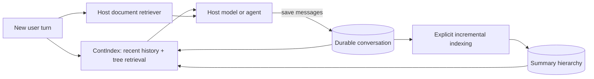

# Conversation memory for your existing application

ContIndex is a conversation-memory library for a host application's RAG chat or agent loop.
The application saves messages, explicitly indexes them, and asks for bounded historical
context before generating its next response. It can use any model through the provider
interface. Existing document retrieval stays in the host.

Current implementations run in Python and Node.js with a durable local SQLite path and one
owning application process per history. The source implementations pass the tree-memory
fixtures in both directions. This does not establish browser, edge-worker, multi-writer,
serverless ephemeral-disk, or published-package support.



## Python

Install the source package with `python -m pip install -e ./packages/python`. The application
supplies an adapter implementing `async complete(ProviderRequest) -> ProviderResponse`. Map
the adapter's response text and actual reported token usage; leave missing usage unset. Set
the model identity, credentials, and maximum output tokens in that adapter. No provider is
selected or contacted by import or ingestion.

```python
from cci import HistoryStore
from cci.config import Config
from cci.index import index
from cci.memory import prepare_context
from cci.provider import MemoizedProvider

async def recall(path, question, your_adapter):
    async with await HistoryStore.open(path, config=Config(cache_backend="none")) as memory:
        provider = MemoizedProvider(your_adapter, memory.config)
        # Explicit host policy: invoke after a batch, not necessarily on every turn.
        report = await index(memory, provider=provider)
        context = await prepare_context(
            memory, question, provider=provider, mode="tree",
            recent_messages=4, max_messages=8, max_chars=8000, excerpt_chars=1000,
        )
        # Your RAG/agent receives context.text alongside its document evidence and new question.
        return context, report
```

For a tokenizer-specific cap, also pass `max_tokens=2000` and
`token_counter=lambda text: len(your_tokenizer.encode(text))`. This limits the rendered memory
text only. The host budgets its instructions, question, document results, tool schemas, and
answer output separately. A character count is never reported as tokens.

The [Python chat adapter](../examples/python/rag_chat.py) wires retrieval, user-message
persistence, document RAG, the application's generator, and assistant-message persistence
into a turn. It records the user message before generation so a model failure leaves that
message available. Stable turn IDs deduplicate writes; the host must handle request replay
and concurrent-turn scheduling. This adapter does not guarantee exactly-once model execution.

## TypeScript

Build the native package with `npm --prefix packages/typescript run build`, then install it
into your host with `npm install /absolute/path/to/cont-index/packages/typescript`.

```typescript
import { HistoryStore, BoundedProvider, index, prepareContext } from "chat-context-index";
import type { Provider } from "chat-context-index";

async function recall(path: string, question: string, adapter: Provider) {
  const memory = await HistoryStore.open(path, { cacheBackend: "none" });
  try {
    const provider = new BoundedProvider(adapter, memory.config);
    const report = await index(memory, provider);
    const context = await prepareContext(memory, question, {
      mode: "tree", provider, recentMessages: 4,
      maxMessages: 8, maxChars: 8000, excerptChars: 1000,
    });
    return { context, report };
  } finally {
    await memory.close();
  }
}
```

The [TypeScript chat adapter](../examples/typescript/rag-chat.mjs) uses the same host-owned
generation and document-retrieval boundary. `maxTokens` plus `tokenCounter` provides the
equivalent tokenizer-specific memory budget. Native TypeScript currently bounds provider
work but does not implement Python's optional exact-request memoization.

## What the tree does

The implementation follows ChatIndex's useful architectural idea: summaries guide navigation
to original conversation segments. See its pinned [tree implementation](https://github.com/VectifyAI/ChatIndex/blob/7df2c9208db6f113f85a6c09295bec7f0f2114e7/ctree/ctree.py)
and [retrieval implementation](https://github.com/VectifyAI/ChatIndex/blob/7df2c9208db6f113f85a6c09295bec7f0f2114e7/retrieval/llm_tools.py).
ContIndex's new implementation is independent: it groups consecutive chunks into bounded
branches, rather than reproducing ChatIndex's LLM topic-boundary detection and autonomous
tool loop. It returns original-message evidence rather than treating generated summaries as
verified source text.

- `index()` summarizes new leaves and newly formed ancestor groups. Unchanged branches keep
  their summaries and IDs. Planning currently reads existing node metadata and republishes
  topology; model-call reuse is incremental, not a claim of logarithmic database write cost.
- The planner reserves calls for parent summaries. A large backlog can require multiple
  explicit calls with `status="partial"` before coverage is complete. Failure preserves the
  previously committed tree and raw messages. A no-change rerun makes zero model calls.
- `retrieve(..., provider=...)` / `retrieve(..., {provider})` traverses offered summaries,
  validates every selected ID, and resolves selected chunks back to original messages.
  Logical navigation steps, physical attempts including retries, and evidence size are bounded.
- `lexical` always makes zero model calls. With no provider, `auto` remains lexical. Provider
  failure, invalid routing output, or a changed index falls back to captured lexical evidence
  with diagnostics. An old flat index can require `index(rebuild=True)` / `index(..., true)`.
- `prepare_context` / `prepareContext` reserves recent records, adds retrieved evidence,
  deduplicates source fields, and restores chronological order. Its character/token limits
  include evidence labels. Omissions and truncation are explicit. Text that cannot fit is
  omitted; callers choose excerpt and total budgets for their workload.

Older paraphrases depend on the routing model's quality. Unindexed messages remain available
through recent context and lexical search. A small budget can miss relevant branches. Earlier
statements and corrections remain separate records; there is no automatic fact resolution.

## What continuing an agent means

Reopening the same durable history restores conversation records and the tree. Saving decisions,
progress, and next steps as messages lets the next agent call retrieve them. Tool text remains
historical data and is never replayed as a live tool call.

Reliable execution resumption also needs the host's checkpoints: task status, tool-call IDs,
completed side effects, pending work, and retry rules. ContIndex is not an executor or a job
queue. A crash after a tool acts but before its result is saved cannot be resolved from chat
memory alone. The host also owns authentication, history selection, and storage durability.

## Cost evidence and limits

The [tree evaluation](../evaluations/tree_memory.py) measures source-checkout mechanics with
128 synthetic messages and a deterministic provider double. Its
[recorded report](../evaluations/results/tree-memory.json) separates indexing, navigation,
and final memory context. It is not a retrieval-quality or dollar-cost benchmark.

The decision criterion for a real workload is:

```text
index build/update cost + navigation cost + answering with selected memory
    < answering with the baseline context strategy
```

Measure actual input/output tokens, each model's price, retries, cache discounts, latency,
and answer correctness over the same sequence of turns. Compare full replay, recent history,
lexical retrieval, and a strong existing memory/RAG baseline. Tree overhead can lose on short
conversations, frequent index updates, or poor routing. Shorter final prompts alone do not
prove lower total cost.
